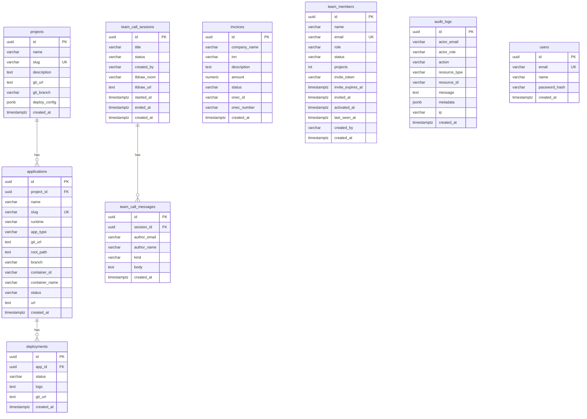

# ER-диаграмма базы данных платформы

Схема создаётся при старте `gateway-service` через `init_db()` (`backend/gateway-service/src/core/database.py`). Отдельных SQL-миграций нет — новые колонки добавляются через `_ensure_column()`.

## Диаграмма сущностей



## Группы таблиц

| Группа | Таблицы | Назначение |
|--------|---------|------------|
| Хостинг | `projects`, `applications`, `deployments` | Проекты, приложения, история деплоев |
| Биллинг | `invoices` | Счета и интеграция с 1С |
| Команда | `team_members`, `audit_logs` | Участники, роли, журнал действий |
| Созвоны | `team_call_sessions`, `team_call_messages` | Комнаты созвонов, чат и заметки доски |
| Auth (заготовка) | `users` | Локальные учётные записи (MVP) |

## Созвоны и realtime

```
team_call_sessions
  id              → room id для LiveKit и call WebSocket
  tldraw_room     → room id для tldraw sync WebSocket
  tldraw_url      → метаданные/ссылка на доску (legacy embed)
  status          → active | ended

team_call_messages
  session_id      → FK на team_call_sessions
  kind            → chat | whiteboard | system
  body            → текст сообщения или JSON-снимок доски
```

Realtime-слой **не хранится в PostgreSQL** (in-memory в gateway / tldraw-sync):

- Call signaling: `WS /api/v1/platform/ws/calls/{session_id}`
- Tldraw sync: `WS /api/v1/platform/ws/tldraw/{tldraw_room}`
- LiveKit SFU: отдельный сервис, токен через `GET /api/v1/platform/team/calls/{id}/livekit`

## Связи и каскады

- `applications.project_id` → `ON DELETE CASCADE`
- `deployments.app_id` → `ON DELETE CASCADE`
- `team_call_messages.session_id` → `ON DELETE CASCADE`

## Индексы

Явные индексы в `init_db()` не создаются. Для production рекомендуется добавить:

- `team_members(email)` — уже UNIQUE
- `team_call_sessions(status, created_at DESC)` — активный созвон
- `team_call_messages(session_id, created_at)` — история чата
- `audit_logs(created_at DESC)` — журнал аудита
